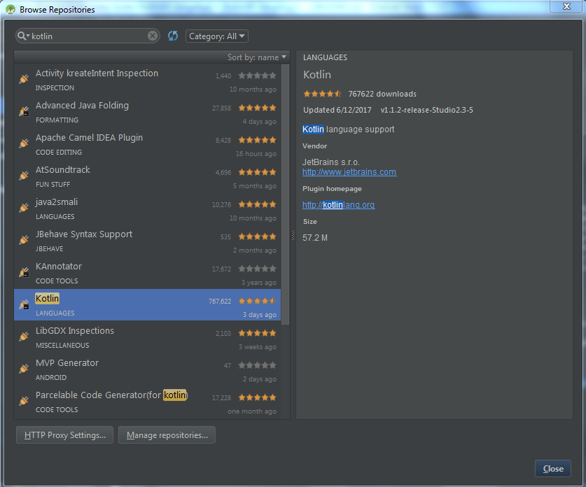
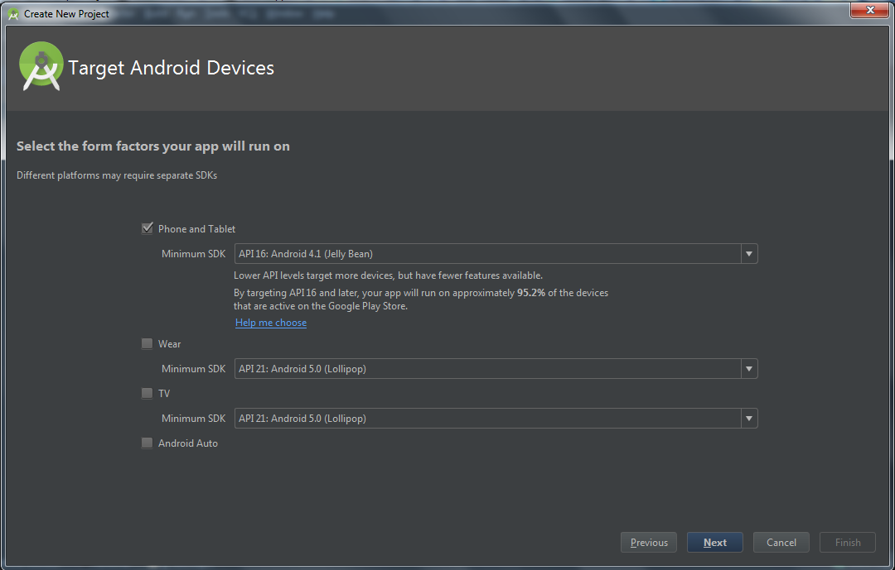
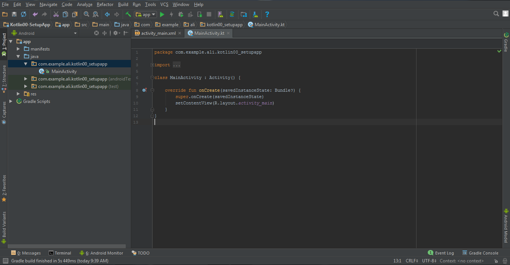
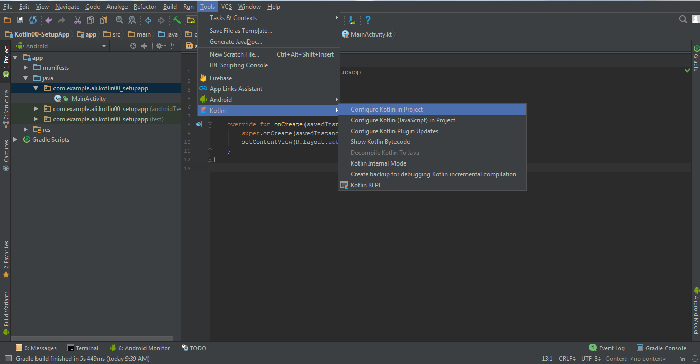
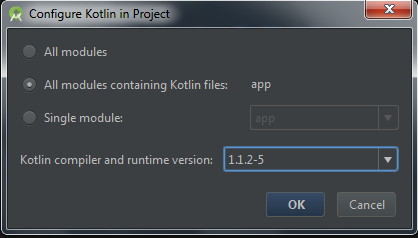

# Kotlin Installation in Android ver less then 3.0
Kotlin installation using Kotlin Plugin
  Goto: File -> Settings -> Plugin -> Browse Repository -> Search: Kotlin
 

## Setup Activity for Kotlin
First Start a new project and configure it same as the other android project:

 
Our project is setup successfully. First we need to convert our Java file to Kotlin file. Select the java file "MainActivity.java" and navigate to ToolMenu option Code -> then select: Convert Java File to Kotlin File.

 You can check your java file successfully converted into Kotlin file.

 
Now we need to configure Kotlin in our project. Navigate to Tools -> Kotlin -> Configure Kotlin in Project

 
Kotlin successfully configured into project. Now you are ready to work on the upcoming official android language KOTLIN.

## Contributors

Contributer: Ali Azaz Alam <ali.azaz.alam@hotmail.com>